# 카페로그 Cafelog
- Android, 1인 제작

  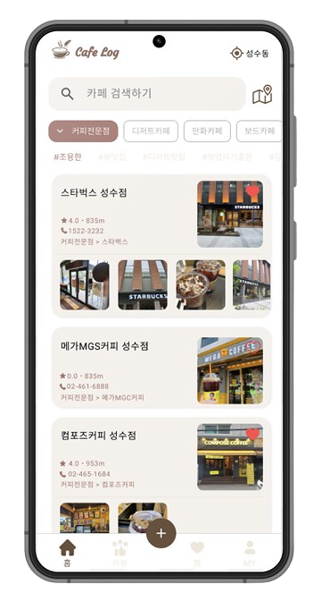
  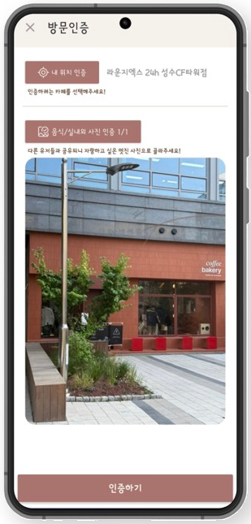
  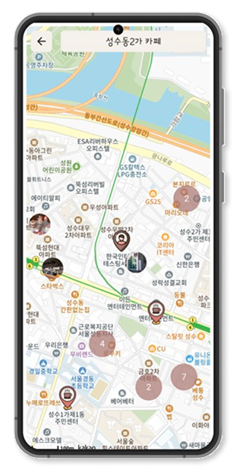

## 개요
### 카페를 좋아하고 애용하는 사용자를 위한 카페 방문 인증 앱입니다.
- 내 위치를 활용해 카페 주변에서 방문 인증을 진행할 수 있으며, 레벨업 시스템을 통해 재미 요소를 제공합니다.

- 카카오 지도와 리뷰 작성 기능을 통해 카페 정보와 전문 지식을 다른 사용자와 공유할 수 있습니다.

## 기술 스택
- 개발언어 : Kotlin, html, css, JavaScript, php
- 네트워크 : Retrofit2
- DB : MySQL
- 배포서버 : 닷홈(무료 호스팅 서버)
- 개발환경 : Android Studio, Visual Studio Code
- 외부 SDK/API : KakaoSDK(로그인, 지도), Kakao 로컬 검색 API, NaverSDK(로그인), Naver Search API(이미지 검색)

## 사용기술
- REST API, Retrofit
- php, MySQL, CURD 구현
- Kakao Login API, Kakao 로컬 키워드 검색 API
- Naver Login API, Naver 이미지 검색 API
- 무한 스크롤 페이징 구현
- 지도 클러스터링 구현

## UI Flow

  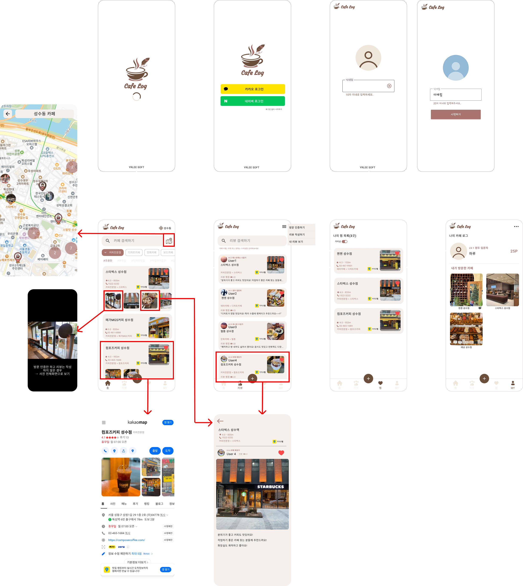

## 주요기능
### 1) 로그인&회원관리
### - 소셜/로컬 로그인

  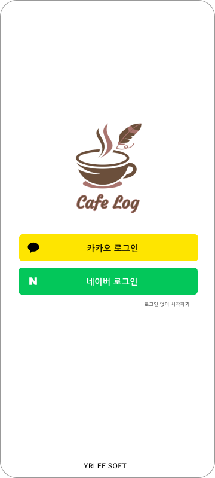
  

### 2) 카페검색&필터링
#### - 카카오 로컬 검색 API 활용
#### - 카페로그 DB에 저장된 카페 정보 조회 및 반영 (해시태그, 카페 이미지, 방문인증 리스트 등)
#### - 카페 아이템 클릭 시 카카오 상세 화면으로 이동

  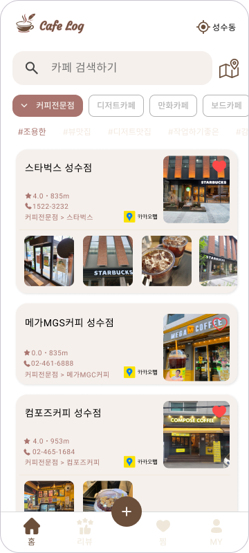
  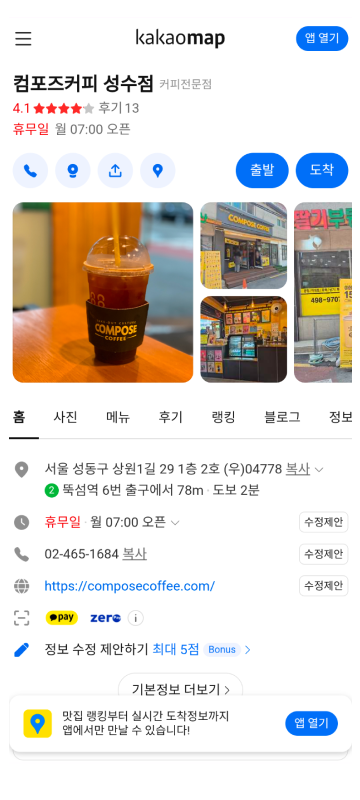

### 3) 방문인증 - 내 위치 인증
#### 사용자의 현재 위치를 확인
#### 방문 인증하려는 카페에서 100m 이내에 위치할 때 인증 가능

  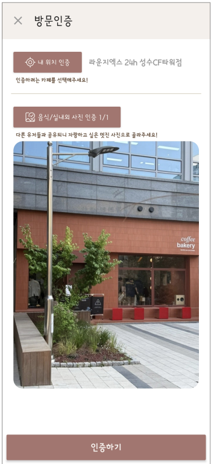
  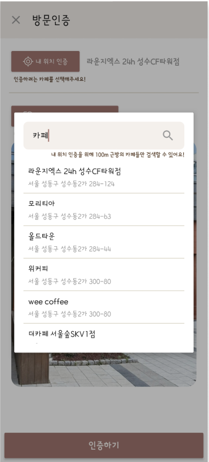
  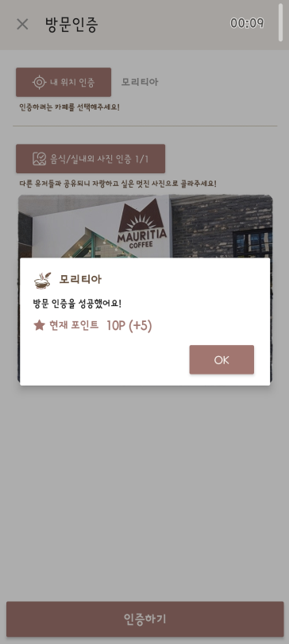

### 4) 리뷰작성

  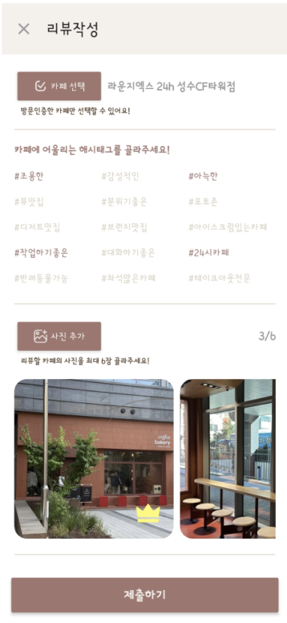
  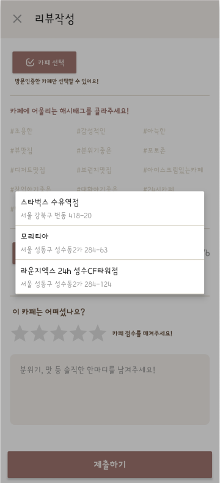
  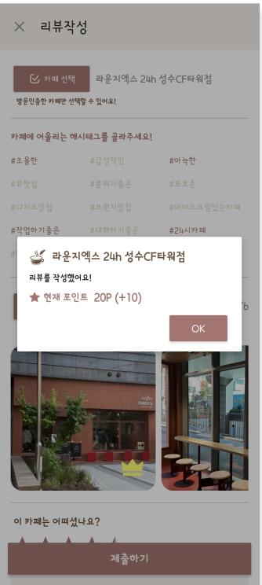

### 5) 리뷰조회

  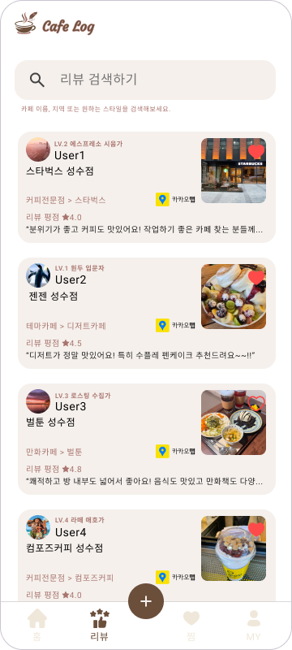

### 6) 지도 - 카페조회

  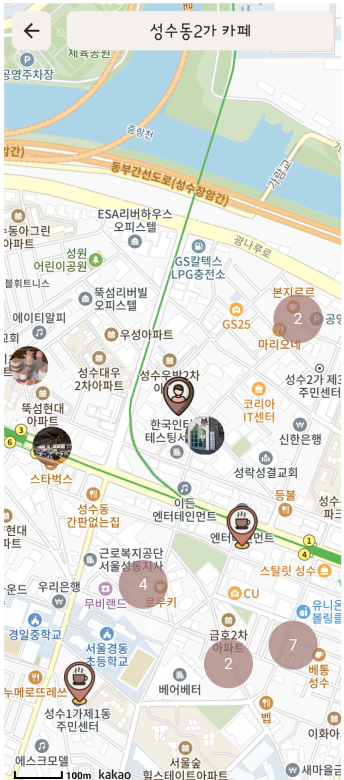
  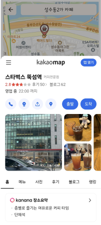

